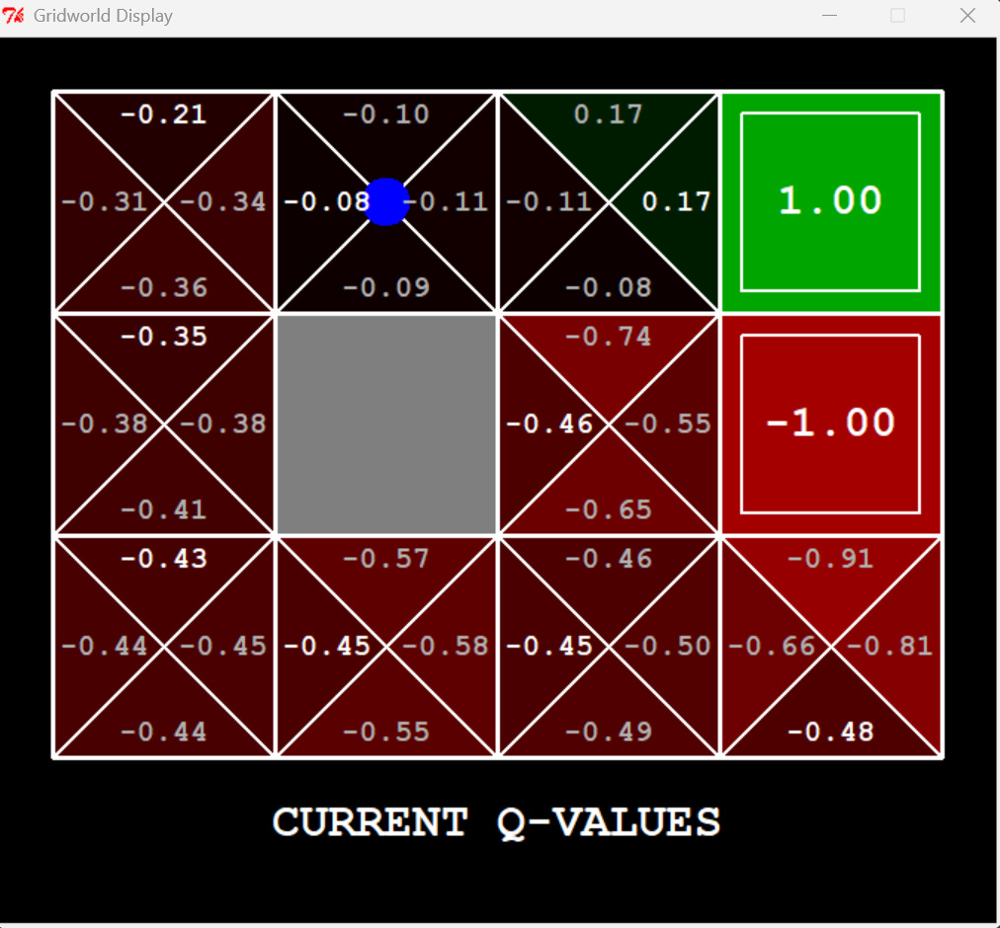

# RL-Gridworld-Assignment

This project is a re-implementation of the UC Berkeley Gridworld project, designed to illustrate Reinforcement Learning (RL) concepts.

## Model Running

## File Analysis

The repository contains the following key files:

-   `environment.py`: Defines the `Environment` class, which provides an interface for interacting with the Gridworld.
-   `gridworld.py`: Implements the core Gridworld environment, including the `Gridworld` MDP, `GridworldEnvironment`, and `Grid` data structure. It also contains the main function to run the Gridworld with different agents.
-   `learningAgents.py`: Contains base classes for RL agents, such as `ValueEstimationAgent` and `ReinforcementAgent`.
-   `mdp.py`: Defines the `MarkovDecisionProcess` class.
-   `qlearningAgents.py`: Implements Q-learning agents, such as the `QLearningAgent` class.
-   `valueIterationAgents.py`: Implements value iteration agents, such as the `ValueIterationAgent` class.
-   `textGridworldDisplay.py`: Provides a text-based display for the Gridworld.
-   `graphicsGridworldDisplay.py`: Provides a graphical display for the Gridworld.
-   `util.py`: Includes useful data structures like `Counter`, `Stack`, `Queue`, and `PriorityQueue`.
-   `game.py`: Provides core classes and functions for defining and running games, including `GameStateData`, `Grid`, and `Game`.
-   `featureExtractors.py`: Includes feature extractors for RL agents.

These files collectively define the Gridworld environment, RL agents, and visualization tools necessary to explore and understand RL algorithms.